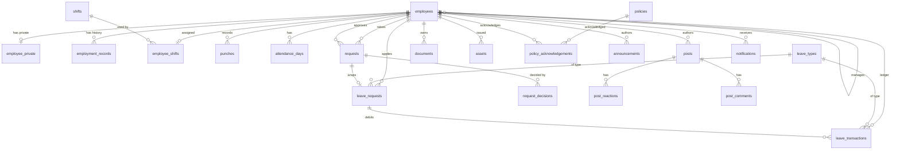

# 4. Database Documentation

**Status: designed, not applied.** The SQL lives in `supabase/migrations/`. No Supabase
project exists yet, so no table has ever been created. Everything below describes what
those migrations will produce.

- Engine: Postgres 17 (Supabase)
- Intended project: `magppie-hr-prod`, org `Magppie1234's Org`, region `ap-southeast-1`
- Extensions: `pgcrypto` (for `gen_random_uuid()`), `citext` (case-insensitive email)

---

## ER diagram

---

## Tables

### `employees` — the directory row, company-visible
| Column | Type | Notes |
| --- | --- | --- |
| `id` | uuid PK | `gen_random_uuid()` |
| `auth_user_id` | uuid UNIQUE → `auth.users` | **null until first sign-in**; not everyone has an account |
| `employee_code` | text UNIQUE | e.g. `MAG-0008` |
| `full_name` | text | |
| `work_email` | citext UNIQUE | the Google SSO join key |
| `photo_url` | text | null; no storage yet |
| `department`, `designation`, `location` | text | |
| `manager_id` | uuid → `employees` | null for the top of the tree |
| `joining_date` | date | |
| `employment_type` | enum | full-time / part-time / contract / intern |
| `status` | enum | active / probation / notice / inactive |
| `probation_end_date` | date | null unless on probation |
| `role` | enum | employee / manager / hr_admin — **authoritative, drives RLS** |
| `birth_month_day` | text `MM-DD` | birthday without the year |
| `created_at`, `updated_at` | timestamptz | `updated_at` maintained by trigger |

Constraint `employees_not_own_manager`: `manager_id <> id`.
Indexes on `manager_id`, `department`, `status`.

### `employee_private` — everything a colleague may not read
| Column | Type |
| --- | --- |
| `employee_id` | uuid PK → `employees` ON DELETE CASCADE |
| `personal_phone` | text |
| `date_of_birth` | date |
| `created_at`, `updated_at` | timestamptz |

**Why separate:** RLS is row-level. Splitting is the only honest way to protect a column.

### `employment_records` — history, so past views stay correct
`id`, `employee_id`, `department`, `designation`, `manager_id`, `valid_from`,
`valid_to` (null = current). Constraint: `valid_to >= valid_from`.
Index on `(employee_id, valid_from desc)`.

### `shifts` / `employee_shifts`
`shifts`: `id`, `name` UNIQUE, `start_time`, `end_time`, `expected_hours`, `flexible`.
`employee_shifts`: `employee_id` PK, `shift_id`, `assigned_on`.
**Flagged:** one shift per person. Rostering is its own module.

### `holidays`
`id`, `date`, `name`, `optional`. UNIQUE `(date, name)`.

### `punches` — append-only evidence
`id`, `employee_id`, `punched_at` timestamptz, `direction` (in/out),
`source` (web/mobile/biometric/manager-marked), `location`, `created_at`.
Index `(employee_id, punched_at)`.
**No UPDATE or DELETE policy exists.** Corrections go through regularisation.

### `attendance_days` — derived, never typed in
`id`, `employee_id`, `date`, `status`, `first_in`, `last_out`, `total_hours`,
`was_regularised`, `updated_at`. UNIQUE `(employee_id, date)`. Index on `date`.
Maintained by `refresh_attendance_day()`, called from a trigger on `punches`.

### `leave_types`
`id`, `name` UNIQUE, `accrues`, `half_days_allowed`, `can_go_negative`, `active`.

### `leave_requests`
`id`, `employee_id`, `leave_type_id`, `start_date`, `end_date`, `half_day_start`,
`half_day_end`, `reason`, `status`, timestamps. Constraint `end_date >= start_date`.

### `leave_transactions` — the ledger
`id`, `employee_id`, `leave_type_id`, `date`, `amount` (>0), `direction`
(credit/debit/adjustment), `reason`, `source`, `leave_request_id`, `created_at`.
Index `(employee_id, leave_type_id, date)`.

**A balance is never stored.** It is `sum(credit + adjustment) - sum(debit)`. This is what
makes the "how was this worked out" expander possible and truthful.

### `requests` — the generic approval object
`id`, `type` (11 values), `raised_by`, `raised_on`, `current_approver`, `status`,
`payload` jsonb, `leave_request_id`, `updated_at`.
Indexes `(current_approver, status)` and `(raised_by, raised_on desc)`.

### `request_decisions`
`id`, `request_id`, `decided_by`, `decided_on`, `decision`
(approved/rejected/commented), `comment`. Append-only in practice.

### `documents`
`id`, `employee_id` **nullable — null means company-wide**, `type`, `file_name`,
`storage_path`, `uploaded_by`, `uploaded_on`, `visibility`
(employee/manager/hr-only), `archived`.

### `policies` / `policy_acknowledgements`
`policies`: `id`, `title`, `version`, `published_on`, `summary`, `body text[]`, `active`.
UNIQUE `(title, version)`.
`policy_acknowledgements`: UNIQUE `(policy_id, employee_id)` — acknowledging twice is a
no-op, not an error.

### `assets`
`id`, `employee_id`, `name`, `category`, `serial`, `assigned_on`, `status`, `updated_at`.

### `announcements`, `posts`, `post_reactions`, `post_comments`, `notifications`
`post_reactions` PK is `(post_id, employee_id, type)` — reactions are rows, not JSON on
the post, so two people reacting at once cannot overwrite each other. The brief's `Post`
shape nests `reactions` and `comments`; the data layer reassembles that shape on read.

---

## Enums

`app_role` · `employee_status` · `employment_type` · `punch_direction` · `punch_source` ·
`attendance_status` · `leave_direction` · `leave_source` · `request_status` ·
`request_type` · `decision_kind` · `document_type` · `document_visibility` ·
`asset_category` · `asset_status` · `reaction_type`

Values match `src/lib/types.ts` exactly, including hyphenation (`'half-day'`,
`'pending-regularisation'`, `'hr-only'`).

---

## Row-level security

RLS is enabled on **all 22 tables**. A table with RLS on and no matching policy denies the
request, which is the intended default here.

### Helper functions (SECURITY DEFINER, STABLE, `search_path` pinned)
| Function | Returns |
| --- | --- |
| `current_employee_id()` | the employee row for `auth.uid()` |
| `current_app_role()` | that employee's role |
| `is_hr_admin()` | boolean |
| `manages(target)` | is `target` anywhere below me in the tree (recursive CTE) |
| `can_see_person(target)` | `target = me OR is_hr_admin() OR manages(target)` |

They are SECURITY DEFINER because they read `employees` to decide who you are, and must
not be filtered by the policies they exist to evaluate. `search_path` is pinned so a
caller cannot shadow a table name.

### Policy summary
| Table | Read | Write |
| --- | --- | --- |
| `employees` | any authenticated | HR only |
| `employee_private` | `can_see_person` | HR only (self-edits go through a request) |
| `employment_records` | `can_see_person` | HR only |
| `shifts`, `holidays`, `leave_types`, `policies` | any authenticated | HR only |
| `employee_shifts` | any authenticated ⚠️ | HR only |
| `punches` | `can_see_person` | INSERT self, or manager/HR as `manager-marked`. **No update/delete.** |
| `attendance_days` | `can_see_person` | none — trigger only |
| `leave_requests`, `leave_transactions` | `can_see_person` | none — RPC only |
| `requests` | raised-by / approver / manages / HR | none — RPC only |
| `request_decisions` | via parent request | none — RPC only |
| `documents` | org-wide, or own (not hr-only), or manager if `visibility='manager'`, or HR | HR; self-insert non-hr-only |
| `policy_acknowledgements` | `can_see_person` | INSERT self |
| `assets` | `can_see_person` | HR only |
| `announcements` | all (non-archived) | HR only ⚠️ |
| `posts`, `post_comments` | all (non-archived) | insert own, archive own or HR |
| `post_reactions` | all | own only |
| `notifications` | own only | mark own read |

⚠️ = a flagged assumption, see `docs/13-bugs-and-open-questions.md`.

---

## Sample data

`0004_reference_data.sql` seeds **reference data only** — 6 leave types, 5 shifts,
11 holidays for 2026. It deliberately seeds **no people**: the 40 employees in the front
end are invented, and loading real staff into a database outside India is a decision for
HR.

For development you can port the mock generator in `src/mocks/` — it produces 40
employees, ~3 months of punches and attendance, a full leave ledger, and ~80 requests, all
deterministic from a fixed seed.

**Edge cases the mock set deliberately includes, and any real seed should too:**
- one person with no manager (top of tree)
- one manager with exactly eight direct reports
- one person on probation, one on notice, one inactive
- an archived document, a returned asset, a rejected leave request, a cancelled one
- days with an in-punch and no out-punch (pending regularisation)
